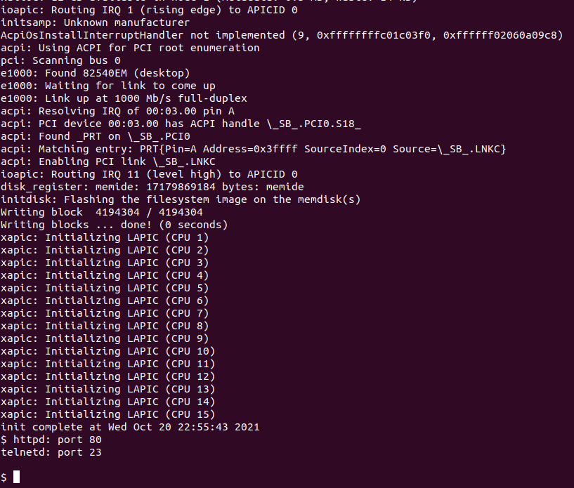

# KhronOS
=====================================================================

This repository contains the code for KhronOS, an scalable
operating systems based on sv6 (MIT) with MV-RLU (multi-version concurrency control mechanism).
KhronOS has been tested on qemu and native hardware with with Intel x86\_64 Processor.

We have released this prototype under an open-source license to enable collaboration with parties outside. It is composed of multiple modules: Scalefs based on sv6, MV-RLU and libraries. KhronOS is under the Apache 2.0 license(```./LICENSE```), Scalefs follows MIT license(```./os/sv6/scalefs/LICENSE.scalefs```), MV-RLU is under the Apache 2.0 license(```./sync/mvrlulib/LICENSE.mvrlu```). Each file in Scalefs may have its own copyright/license that is embedded in the code.

## Directory structure (with License files)
```{.sh}
mvcc-os
├── LICENSE         # KhronOS license
├── doc             # documents
├── sync            # sync library
│   ├── mvrlulib      	# MV-RLU library
│   |   ├── LICENSE.mvrlu 	# MV-RLU license
│   ├── include         # include
├── os           	# os
│   ├── sv6         	# sv6
│   |   ├── LICENSE.sv6 	# sv6 license
│   ├── scalefs        	# scalefs
│   |   ├── LICENSE.scalefs	# Scalefs license
└── tools           # tools
```

Building and running KhronOS
--------------------------------
```{.sh}
cd os/sv6/scalefs
make && make qemu
```

Running benchmarks
--------------------------------
On a KhronOS prompt
```{.sh}
run\_hlbench.sh
kbench $arguments
```

```
TBD `application and other benchmark`
```

What is sv6 and Scalefs
--------------------------------
sv6 is a POSIX-like research operating system designed for multicore
scalability based on [xv6](http://pdos.csail.mit.edu/6.828/xv6).

sv6 is not a production kernel.  Think of it as a playground full of
half-baked experiments, dead code, some really cool hacks, and a few
great results.


Scalefs Booting Screen (QEMU)
------------------------
 


Building and running sv6 in QEMU
--------------------------------

TL;DR: `make && make qemu`

You'll need GCC version 4.7 or later and GNU make.

There are several variables at the top of the top-level `Makefile` you
may want to override for your build environment.  It is recommended
you set them in `config.mk`.

The kernel is configured via `param.h`.  If you're just running sv6 in
QEMU, you don't have to modify `param.h`, but you may want to read
through it.

The most important `Makefile` variable is `HW`.  This controls the
hardware target you're building for and affects many settings both in
the `Makefile` and `param.h`.  The default `HW` is `qemu`.  Each of
our multicore machines also has a `HW` target (like `josmp` and
`ben`), and other interesting `HW` targets are mentioned below.
Builds go to `o.$HW`.

### Common problems

`panic: unhandled inode 369 type 0` on boot: This seems to be a bug in
the virtual IDE controller of some versions of QEMU (though we're not
positive).  Try upgrading (or downgrading) QEMU.


Running sv6 on real hardware
----------------------------

Make sure you can build and boot sv6 in QEMU first.

Start by adding a `HW` target to `param.h` using one of the "physical
hardware targets" in `param.h` as a template.

For `HW` targets where `MEMIDE` is defined to `1` (the default), the
file system image is baked directly into the kernel image.  This makes
it possible to boot a physical machine into the sv6 kernel with
nothing but the kernel image itself, and without having to worry about
messing up your disks.

The kernel image is `o.$HW/kernel.elf`.  This file is
multiboot-complaint, so both GRUB and SYSLINUX can boot it directly.
You can also PXE boot this image over the network using PXELINUX
(that's what we do).


Optional components
-------------------

### lwIP

To enable networking support, you'll need to clone lwIP.  From the
root of your sv6 clone,

    git clone git://git.savannah.nongnu.org/lwip.git
    (cd lwip && git checkout DEVEL-1_4_1 && patch -p1 < ../lwip.patch)
    make clean

(If you are building another hardware target, be sure to set `HW` when
invoking `make clean`.)

### mtrace

sv6 can be run under an mtrace-enabled QEMU to monitor and analyze its
memory access behavior.  You'll need to build and install mtrace:

    git clone https://github.com/aclements/mtrace.git

And build with `HW=mtrace`.  If mtrace isn't cloned next to the sv6
repository, then set `MTRACESRC` in `config.mk` to the directory
containing `mtrace-magic.h`.

To run under mtrace, `make mtrace.out`.


Supported hardware
------------------

Not much.

sv6 is known to run on five machines: QEMU, a 4 core Intel Core2, a 16
core AMD Opteron 8350, 48 core AMD Opteron 8431, and an 80 core Intel
Xeon E7-8870.  Given the range of these machines, we're optimistic
about sv6's ability to run on other hardware.  sv6 supports both
xAPIC- and x2APIC-based architectures.

For networking, sv6 supports several models of the Intel E1000,
including both PCI and PCI-E models.  If you have an E1000, you'll
probably have to add your specific model number to the table in
`kernel/e1000.cc`, but you probably won't have to do anything else.


Running sv6 user-space in Linux
-------------------------------

Much of the sv6 user-space can also be compiled for and run in Linux
using `make HW=linux`.  This will place Linux-compatible binaries in
`o.linux/bin`.

You can also boot a Linux kernel into a pure sv6 user-space!  `make
HW=linux` also builds `o.linux/initramfs`, which is a Linux initramfs
file system containing an sv6 init, sh, ls, and everything else.  You
can boot this on a real machine, or run a super-lightweight Linux VM
in QEMU using

    make HW=linux KERN=path/to/Linux/bzImage/or/vmlinuz qemu


How to
======

CPU profiling
-------------

sv6 supports NMI-based system-wide hardware performance counter
profiling on both Intel and AMD CPUs.  On recent Intel CPUs, it also
supports PEBS precise event sampling and memory load latency
profiling.

To profile a command, use the `perf` tool.  E.g.,

    perf mailbench -a all / 1

By default, `perf` monitors unhalted CPU cycles, but other events can
be selected from those known to `libutil/pmcdb.cc`.

Once `perf` has run, the sampler data can be read from `/dev/sampler`.
To transfer the file to your computer where it can be decoded, use the
web server:

    curl http://<hostname>/dev/sampler > sampler

Finally, to decode the sample file, use `perf-report`:

    ./o.$HW/tools/perf-report sampler o.$HW/kernel.elf

To get stack traces from a user binary, pass its unstripped ELF image
(e.g., `o.$HW/bin/ls.unstripped`) as the last argument instead of the
kernel image.


Kernel statistics
-----------------

The kernel continually maintains a lot of internal statistics
counters.  To see the changes in these counters over a command, run,
e.g.

    monkstats mailbench -a all / 1


Development guide for KhronOS
------------------------------
Here are some example of applying MV-RLU/RLU to the OS components.
```{.sh}
os/sv6/scalefs/hlbench_mvrlu.c
os/sv6/scalefs/kernel/sysbench.cc
os/sv6/scalefs/kernel/scalefs.cc
```


Contribution guide for KhronOS
------------------------------
We welcome any contribution from open source developers to the KhronOS. We have following outstanding issues and interesting topics.
 - Apply MV-RLU/RLU to shared data structures in Scalefs to improve scalability on many-core machines 
 - Hack VM layers for improving scalability with MV-RLU/RLU 
 - Hack Filesystem (memory and disk layers) for improving scalability with MV-RLU/RLU

TBD
------------------------------
screen shot for KhronOS booting 
